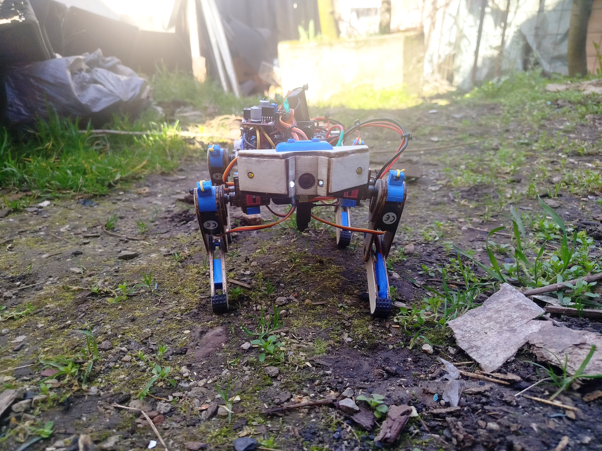

# 🤖 BOBI — The Quadropper

<p align="center">
  
</p>

<p align="center">
  <b>An affordable, modular quadruped robot built for robotics education, remote exploration and experimental metal/magnetic detection.</b>
</p>

<p align="center">
  <a href="https://zandomain.dpdns.org/">🌐 Žan Mujičić Portfolio</a> •
  <a href="#overview">Overview</a> •
  <a href="#features">Features</a> •
  <a href="#hardware">Hardware</a> •
  <a href="#testing-results">Testing</a> •
  <a href="#team">Team</a> •
  <a href="#media--documents">Media & Documents</a>
</p>

---

## 📌 Overview

**BOBI — The Quadropper** is a compact quadruped robot developed as a student robotics project at **JU Mješovita srednja industrijska škola in Zenica, Bosnia and Herzegovina**.

The project focuses on building a useful robotic platform with an emphasis on **low cost, modular construction, remote control and practical experimentation**. The prototype combines a lightweight plywood chassis with 3D-printed PLA parts, 12 servo actuators, an ESP32 controller, a camera, lighting and a metal/magnetic detection system.

The project documentation describes intended applications including hazardous-area assistance, exploration of difficult terrain and education.

> **Project type:** Educational / experimental robotics prototype  
> **Controller:** ESP32  
> **Actuation:** 12 servos, 3 DOF per leg  
> **Programming:** C++  
> **Target weight:** ~480 g  
> **Design approach:** Plywood + 3D printing + modular electronics

---

## 📸 Project Gallery

### BOBI in the field

<p align="center">
  
  
</p>

### Prototype & controller

<p align="center">
  
  
</p>

### Electronics and assembly

<p align="center">
  
</p>

---

## ✨ Features

- 🦿 **Quadruped locomotion** with 3 degrees of freedom per leg
- ⚙️ **12 servo motors** for leg movement
- 🧠 **ESP32** as the main microcontroller
- 📡 Remote operation using an ESP32-based controller
- 🎮 Dedicated controller with **9 pushbuttons + joystick**
- 📱 Phone holder for accessing the robot camera
- 📷 **480p mini camera** for remote observation
- 🧲 Metal/magnetic detection sensor with visual and audible indication
- 💡 Front white LEDs for low-light environments
- 🟡 Yellow side LEDs for signaling
- 🔊 Passive buzzer for detection alerts
- 🌬️ Active cooling with a 30 mm fan and passive heat dissipation
- 🧩 Plywood + 3D-printed modular mechanical construction
- 🔧 Screw-fastened parts for easier replacement and maintenance
- 💻 Programmed in **C++** for future upgrades

---

## 🏗️ Mechanical Design

The chassis uses **2.6 mm plywood**, while joints and brackets are made from **PLA 3D-printed parts**. The mechanical components were modeled in CAD before fabrication, and bearings are used at the joints to support smoother movement.

The robot uses a **3-DOF-per-leg architecture**, giving it 12 degrees of freedom in total. This layout provides a useful balance between mobility, mechanical complexity and weight.

The documented prototype weighs approximately **480 g**.

---

## 🔌 Hardware

| Component | Specification |
|---|---|
| Main controller | ESP32 |
| Servo driver | PCA9685 PWM module |
| Servos | 8× MG90S + 4× SG90 |
| Degrees of freedom | 12 total / 3 per leg |
| Batteries | 2× 18650 Li-ion |
| Battery protection | Up to 20 A |
| Power conversion | 5 V / 2 A step-down + 5 V / 4 A buck-boost |
| Bearings | 8× MR92-ZZ |
| Detection alert | 12 mm passive buzzer |
| Cooling | 30 mm, 5 V / 0.2 A fan |
| Camera | Mini 480p camera, 5 V / 1 A |
| Frame | 2.6 mm plywood |
| Printed parts | PLA |
| Software | C++ |

The hardware list above follows the project's submitted technical documentation.

---

## 🎮 Controller

The custom controller is designed to keep operation simple and accessible.

### Controller hardware

- **ESP32**
- **9 programmable pushbuttons**
- **1 joystick**
- LED indicator for detection
- Phone holder for camera access
- 3D-printed and laser-cut enclosure/components

<p align="center">
  
</p>

The project documentation reports a control range of **over 200 m** under its tested/claimed conditions.

---

## 🧠 Software & Control

BOBI is programmed in **C++**. The project was designed so that the software can be further optimized and expanded.

The walking tests found that the most stable basic gait was achieved when **three legs remain on the ground while one leg performs the movement**. This provides a stable support triangle during the step cycle.

Possible future software work includes:

- improved gait generation
- better balance and center-of-mass control
- terrain adaptation
- smoother servo trajectories
- autonomous navigation
- sensor fusion
- camera-based remote operation
- additional controller commands

---

## 🧪 Testing Results

### Walking stability

| Surface | Stability | Average speed |
|---|---|---:|
| Flat terrain — laminate / tiles | Very stable | **4 cm/s** |
| Concrete | Stable | **3 cm/s** |
| Soil / uneven terrain | Moderately stable | **2.5 cm/s** |

The project documentation also reports:

- Maximum tested descent: **20°**
- Maximum tested ascent: **7.5°**

On uneven terrain, the robot required additional servo correction and moved more slowly, while remaining capable of moving without tipping during the reported tests.

### Metal / magnetic detection experiment

| Distance from sensor | Robot response | Signal |
|---:|---|---|
| **1 cm** | Immediate detection | Strong |
| **1.5 cm** | Detection | Medium |
| **2 cm** | Intermittent detection | Medium → weak |
| **3 cm** | Very rare detection | Very weak |
| **> 4 cm** | No detection | None |

The documented experiment concluded that the sensor performed best at distances up to approximately **2 cm**, with no detection reported beyond 4 cm.

> ⚠️ **Safety note:** BOBI is an educational/experimental prototype. Its metal/magnetic sensor should **not** be treated as a certified mine-detection or demining system, and the robot must not be used to declare an area safe.

---

## 🎯 Project Goals

The project was built around several goals:

1. Develop an affordable quadruped robotic platform.
2. Demonstrate practical robotic locomotion.
3. Explore remote operation of a small mobile robot.
4. Experiment with metal/magnetic anomaly detection.
5. Provide an accessible platform for robotics and programming education.
6. Keep the design modular so damaged parts can be replaced and future upgrades can be added.

The submitted project documentation states an intended total project cost of **under 150 KM** to keep the platform accessible.

---

## 🔧 Manufacturing

The project combines several accessible fabrication methods:

**CAD design → 3D printing / laser cutting → mechanical assembly → electronics → programming → testing**

Main fabrication technologies:

- 🖨️ 3D printing for joints, brackets and custom parts
- 🔥 Laser cutting for plywood components
- 🪵 Plywood for the lightweight structural frame
- 🔩 Screws and bearings for serviceable mechanical joints
- 💻 C++ firmware for the control system

---

## 🚀 Future Development

BOBI's modular design leaves room for substantial upgrades:

- IMU-based stabilization
- automatic balance correction
- improved inverse-kinematics control
- autonomous walking
- better terrain adaptation
- longer-range communication
- improved camera system
- additional environmental sensors
- improved detection electronics
- redesigned lightweight chassis
- custom PCB integration
- more advanced remote-control software

---

## 🌐 More Projects & Information

BOBI is part of a wider collection of robotics, electronics, 3D-printing, CNC, self-hosting and DIY projects.

**More projects, achievements and technical information:**

➡️ **https://zandomain.dpdns.org/**

The portfolio includes additional work such as:
- Robotics and ESP32 projects
- 3D printing and OctoPrint
- CNC laser work
- Custom PCs and electronics
- Home-server and networking projects
- Other technical and DIY projects

## 👥 Team

**Project Team**

- **Žan Mujičić**
- **Amna Kolić**
- **Mirza Čoloman**
- **Adin Kadrić**

**Mentor:** Edina Hodžić

**School:** JU Mješovita srednja industrijska škola  
**Location:** Zenica, Bosnia and Herzegovina

The team and school information is taken from the submitted project documents.

---

## 📁 Repository Structure

```text
BOBI-THE-QUADROPPER/
├── README.md
├── assets/
│   ├── images/
│   │   ├── 01-bobi-outdoor.jpg
│   │   ├── 02-bobi-and-controller.jpg
│   │   ├── 03-controller-render.png
│   │   ├── 04-bobi-workbench.jpg
│   │   └── 05-bobi-concrete.jpg
│   ├── presentation-media/
│   └── document-media/
├── docs/
│   ├── BOBI-The-Quadroper-Presentation.pptx
│   └── BOBI-The-Quadroper-Project-Paper.docx
└── media/
    └── videos/
        ├── 01-bobi-test.mp4
        ├── 02-bobi-test.mp4
        └── 03-bobi-test.mp4
```

---

## 🎥 Media & Documents

The repository package includes the supplied project media:

- **5 project photographs**
- **3 test videos**
- Original **PowerPoint presentation**
- Original **project paper**
- Additional images extracted from the submitted presentation and document

GitHub will display the photographs directly in this README. The videos and original documents are kept under `media/` and `docs/` so the complete project material remains together.

---

## 📚 References

The submitted project documentation references:

- BHMAC — Bosnia and Herzegovina Mine Action Centre
- Boston Dynamics — Spot
- Arduino
- Autodesk Fusion
- Ultimaker Cura
- Craftseek
- Reddit
- Temu

See the original presentation and project paper in `docs/` for the project's cited bibliography.

---

## 🏆 Project Context

BOBI was prepared for the **SCI&TECH Challenge** project context at the University of Zenica / Faculty of Engineering and Natural Sciences.

The submitted presentation identifies the project as **SCI&TECH CHALLENGE 2026** and the team as students of JU Mješovita srednja industrijska škola in Zenica.

---

## 📄 License

No software/open-source license was supplied with the uploaded project materials.

If this repository is published publicly, add the license you want to use (for example MIT, GPL-3.0 or a Creative Commons license for documentation/media) and make sure it matches the rights of all contributors.

---

<p align="center">
  <b>BOBI — The Quadropper</b><br>
  Student Robotics • ESP32 • 3D Printing • CAD • Electronics • Embedded C++
</p>
